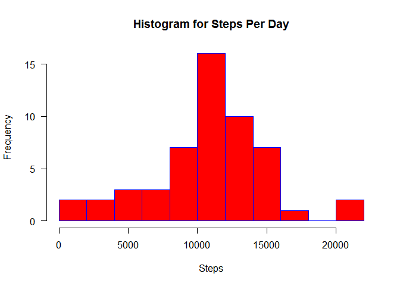
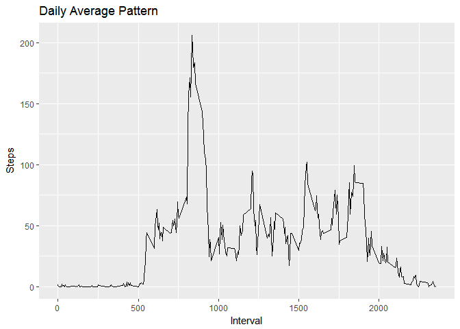
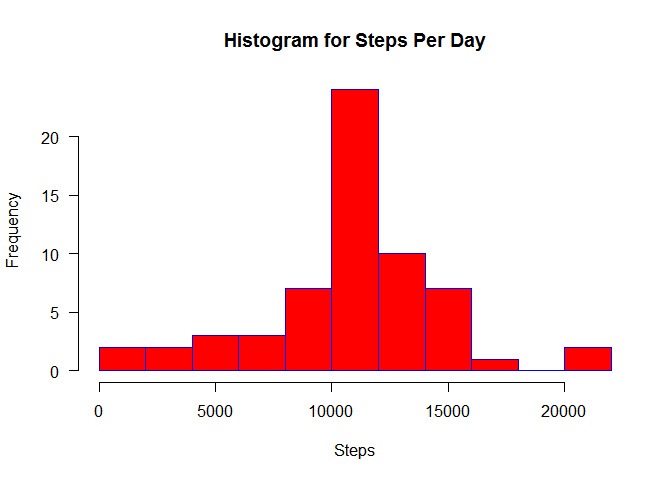
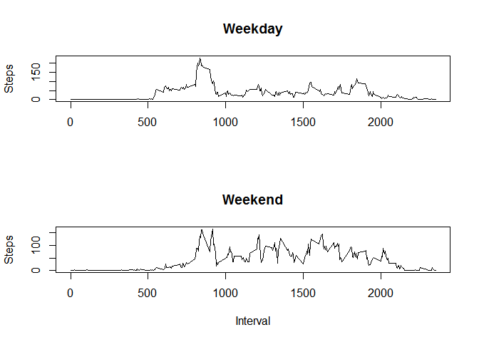

### Read Data In

The first step that I had to take was to load the data into RStudio. I also created a few dataframes that would be useful later in the analysis. avgActivityData contains the avg number of steps per day, sumActivityData contains the total number of steps per day.

``` r
library(ggplot2)
```

    ## Warning: package 'ggplot2' was built under R version 3.3.3

``` r
setwd("C:/Users/peter.kearns/Documents/R_Projects/Coursera/knitrAssignment")
activityData = read.csv("activity.csv")
avgActivityData = aggregate(activityData$steps,list(Date = activityData$date),mean)
colnames(avgActivityData) = c("Date","Steps")
sumActivityData = aggregate(activityData$steps,list(Date = activityData$date),sum)
colnames(sumActivityData) = c("Date","Steps")
```

Questions
---------

### What is mean total number of steps taken per day?

This question was asked to be answered with a historgram plot. The code below is for producing the histogram, and shows that for the majority of days between 10000 and 15000 steps are taken.

``` r
hist(sumActivityData$Steps, 
     main="Histogram for Steps Per Day", 
     xlab="Steps", 
     border="blue", 
     col="red",
     las=1,
     breaks = 10)
```



``` r
mean(sumActivityData[["Steps"]],na.rm=TRUE)
```

    ## [1] 10766.19

``` r
median(sumActivityData[["Steps"]],na.rm=TRUE)
```

    ## [1] 10765

### What is the average daily activity pattern?

To answer this question I aggregated to data over the interval. This gave the avg value for every 5-minute interval that can now be ploted.

``` r
minuteAvgActivityData = aggregate(activityData$steps,list(Date = activityData$interval),mean, na.rm=TRUE)
colnames(minuteAvgActivityData) = c("Interval","Steps")

qplot(data = minuteAvgActivityData, x=Interval,y=Steps,geom = "path",main = "Daily Average Pattern")
```



``` r
minuteAvgActivityData[which(minuteAvgActivityData$Steps == max(minuteAvgActivityData$Steps)),]
```

    ##     Interval    Steps
    ## 104      835 206.1698

### Adding Missing Values

The methodology used to add in the missing values is to take the avg value of the second interval and to use that to substitute the na value.

``` r
sapply(activityData, function(x) sum(is.na(x)))
```

    ##    steps     date interval 
    ##     2304        0        0

``` r
completeActivityData = activityData
completeActivityData$steps[which(is.na(completeActivityData$steps))] = minuteAvgActivityData[match(completeActivityData$interval, minuteAvgActivityData$Interval), "Steps"]
```

    ## Warning in completeActivityData$steps[which(is.na(completeActivityData
    ## $steps))] = minuteAvgActivityData[match(completeActivityData$interval, :
    ## number of items to replace is not a multiple of replacement length

``` r
sumActivityData = aggregate(completeActivityData$steps,list(Date = completeActivityData$date),sum)
colnames(sumActivityData) = c("Date","Steps")
hist(sumActivityData$Steps, 
     main="Histogram for Steps Per Day", 
     xlab="Steps", 
     border="blue", 
     col="red",
     las=1,
     breaks = 10)
```



``` r
mean(sumActivityData[["Steps"]],na.rm=TRUE)
```

    ## [1] 10766.19

``` r
median(sumActivityData[["Steps"]],na.rm=TRUE)
```

    ## [1] 10766.19

Because of the methodology of using the average of the interval we see a few changes. One is that the histogram now contains more observations that are close to the previous mean. We also notice that the mean and median are now the same value.

The explanation of this could be that since some days were missing values they appeared to be lower than the mean, when we added the avg values we got a clearer picture of the data.

### Activity differences between weekdays and weekends.

The process for creating this plot took some time to complete. First I added an extra column to the dataframe that could be used to determine if a observation is from the weekend. Then using that indicator I created 2 dataframes that were subsets of the completeActivityData dataframe. Finally I aggregated these dataframes to be able to plot them.

``` r
weekdayFrame = weekdays(as.Date(completeActivityData$date))
completeActivityData=cbind(completeActivityData, weekdayFrame)


weekendData = completeActivityData[which(completeActivityData$weekdayFrame == "Saturday" | completeActivityData$weekdayFrame == "Sunday"),]
avgWeekendActivityData = aggregate(weekendData$steps,list(Interval = weekendData$interval),mean)
colnames(avgWeekendActivityData) = c("Interval","Steps")

weekData = completeActivityData[which(completeActivityData$weekdayFrame != "Saturday" & completeActivityData$weekdayFrame != "Sunday"),]
avgWeekActivityData = aggregate(weekData$steps,list(Interval = weekData$interval),mean)
colnames(avgWeekActivityData) = c("Interval","Steps")

par(mfrow=c(2,1))
plot(avgWeekActivityData$Interval, avgWeekActivityData$Steps, type = "l",xlab = '', ylab = "Steps",main = "Weekday")
plot(avgWeekendActivityData$Interval, avgWeekendActivityData$Steps, type = "l",xlab = "Interval", ylab = "Steps",main = "Weekend")
```



From these plots it is clear that there is a tendency for people to be more active on the weekend.
